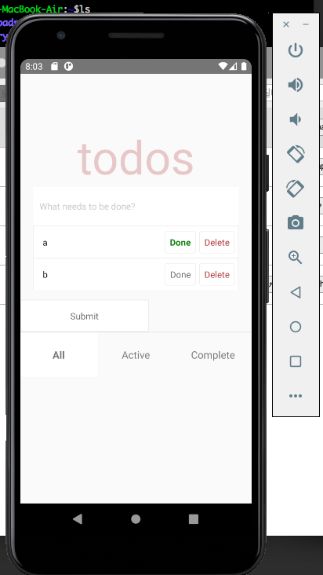

# 처음 만드는 리액트 네이티브 앱

이번 챕터에서는 todoapp을 만들어 볼것.

## todoapp 작성하기

아래와 같은 구조의 todoapp을 작성할 예정이다. 
```
<View>
    <Heading/>
    <Input/>
    <TodoList/>
    <Button/>
    <TabBar/>
</View>
```

## todo앱 코드 작성하기

```
$ npx react-native init TodoApp
$ npm install -g react-native-cli <-- 위의것을 실행하려면 이게 우선적으로 깔려있어야 하는듯.
```

프로젝트의 루트에 app폴더를 만든다.
```
$ npx react-native run-ios
$ npx react-native run-android
```
예제 코드를 작성하고 위의 명령어를 수행하였는데 입력하였는데,, 에러가 뜬다..
```
error Failed to install the app. Make sure you have the Android development environment set up: https://reactnative.dev/docs/environment-setup.
```
8081포트가 살아있었기 때문,,
sudo lsof -i:8081 을 통해 실행중인 프로세스를 확인 후에 해당 프로세스를 킬한다.

여전히 문제는 발생중인데, 에러의 내용을 보니 에뮬레이터를 찾을수 없다는것 같다. 에뮬레이터는 내장된 에뮬레이터가 아니라 안드로이드 스튜디오의 SDK를 이용하는 것으로 보인다.
1. 안드로이드 스튜디오를 설치한다.
2. android폴더에 local.properties파일을
3. local.properties파일에 아래의 내용을 입력한다.
```
sdk.dir = /Users/juhyeontae/Library/Android/sdk
```

하지만,, 다음과 같이 뭔가 라이센스 문제가 뜬다.
```
Checking the license for package Android SDK Build-Tools 28.0.3 in /Users/juhyeontae/Library/Android/sdk/licenses
```
안드로이드 스튜디오에서의 설정하기
1. Configure &gt; SDK 
2. Android SDK &gt; SDK Tools
3. 체크박스중 Google Play Licensing Library클릭

뭔가,, 에뮬레이터를 못찾는 버그가 발생,, 환경변수에 안드로이드 관련 설정을 해줘야 하는듯
````
$ export ANDROID_HOME=/Users/juhyeontae/Library/Android/sdk
$ export PATH=$PATH:$ANDROID_HOME/platform-tools
$ source ~/.bash_profile
```
오오,, 일단 에뮬레이터는 켜졌다. 근데,, 몹시 느림. 시작안됨,, MainActivity못찾는다는 에러,,
com.todoapp.MainActivity
````
npm run android --appId com.todoapp --main-activity MainActivity 
```
성공,, 그러나,,, 에뮤레이터를 써서 그런지 인터넷에서 떠드는 뭔 수정에 대한 확인이 빠르다던지에 대한 것은 의문이다..

좀 해본결과 켜는건 느리지만 rebuild가 빠른듯한 느낌이다. 

우여곡절 끝에 chap03을 마쳤따.!!!
```

## 결과


## 요약
- AppRegistry는 모든 리액트 네이티브 앱을 실행함에 있어서 자바스크립트 진입점입니다.
- 리액트 네이티브의 TextInput 컴포넌트는 HTML의 input요소와 유사합니다. 몇 가지 prop을 지정할 수 있는데, 사용자가 텍스트를 입력하기 전에 텍스트 스타일을 지정하는 placeholderTextColor, TextInput의 커서 스타일을 지정하는 selectionColor가 있습니다.

- TouchableHighlight는 리액트 네이티브에서 버튼을 만드는 한 가지 방법입니다. HTML의 button요소와 유사합니다. TouchableHighlight를 사용해 뷰들을 감싸고 이들 뷰가 터치 이벤트에 적절하게 대응하게 해줍니다.
